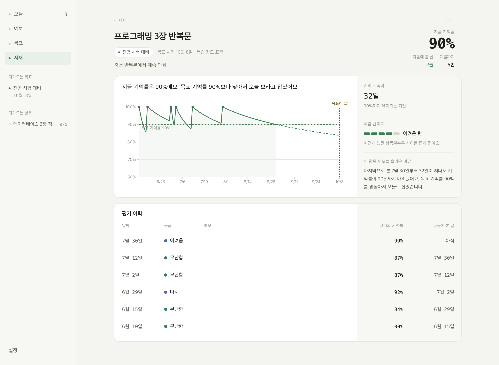
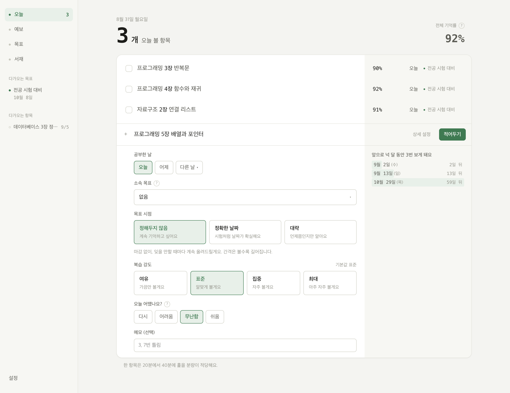

# retention-planner

학습한 것을 기록해두면 복습할 날을 계산해 주는 macOS 학습 플래너입니다.



기억은 시간이 지나면 흐려집니다. 항목마다 그 곡선을 따라가면서 목표 기억률
아래로 내려가기 전에 다시 올려 두는 것이 이 앱이 하는 일입니다.

복습 자체는 앱 밖에서 합니다. 개인적으로 하던 공부를 마치고 돌아와서 네 단계
(다시, 어려움, 무난함, 쉬움) 중 하나를 선택해 자가 평가하면, 다음에 복습할
날짜가 계산됩니다.



제목만 적으면 나머지는 기본값으로 들어갑니다. 목표하는 날이 존재하거나 복습
강도를 따로 정하고 싶을 때는 상세 설정을 사용합니다.

목표하는 날을 정해두는 경우 해당 날짜에 높은 기억률이 유지될 수 있도록 일정을
역산합니다. 해야 하는 복습은 늦어도 그 전날까지 유도하고, 전반적으로 하루에
복습이 몰리지 않게 동적으로 날짜를 조정합니다.

## 시작하기

```bash
pnpm install
pnpm dev
```

브라우저 전용입니다. 해당 상태로도 모든 기능이 동작하고, 데이터는 브라우저에 남습니다.

## 데스크탑 앱으로 빌드

[Rust](https://rustup.rs)와 Xcode가 필요합니다.

```bash
pnpm tauri build
```

결과물은 두 개가 나옵니다.

```
src-tauri/target/release/bundle/macos/retention-planner.app
src-tauri/target/release/bundle/dmg/retention-planner_0.1.0_aarch64.dmg
```

서명하지 않은 앱이라 처음 열 때 한 번 격리 속성을 지워야 합니다.

```bash
xattr -dr com.apple.quarantine src-tauri/target/release/bundle/macos/retention-planner.app
```

데스크탑 앱에서는 데이터가 SQLite 파일로 들어갑니다.

```
~/Library/Application Support/dev.jys705.retention-planner/retention-planner.db
```

## 개발

```bash
pnpm verify   # 타입 검사, lint, 테스트
pnpm test     # 테스트만
pnpm build    # 웹 번들
```

테스트 방법입니다. `tests/golden/`과 `tests/policy/` 는 순수 계산을 값으로
확인하고, `tests/scenarios/` 쪽은 실제 애플리케이션 화면을 근거로 확인합니다.

## 스택

Tauri v2, React 19, TypeScript 5, Vite, Tailwind v4, Recharts, Zustand, SQLite, Vitest.

## 알고리즘

[FSRS-6](https://github.com/open-spaced-repetition/awesome-fsrs/wiki/The-Algorithm) 엔진에
목표 시점 제약과 분산 처리를 더한 구조입니다. 일정 계산은 모두 순수 함수이며
현재 시각을 인자로 전달받습니다.

**엔진.** 파라미터 21개의 DSR 모델입니다. 항목마다 기억 지속력 `S`와 체감 난이도 `D`를 유지합니다.

```
factor  = 0.9^(-1 / w20) - 1
R(t, S) = (1 + factor * t / S)^(-w20)          t일 뒤 회상률
I(r, S) = (S / factor) * (r^(-1 / w20) - 1)    회상률 r 까지의 간격
```

감쇠 지수 `w20` 역시 학습된 파라미터입니다. 복습 강도는 목표 회상률 `r`을
지정하는 설정입니다. 여유 0.85, 표준 0.90, 집중 0.94, 최대 0.97.

**제약.** 목표 시점의 세 가지 형태를 하나의 구간으로 통일한 뒤, 네 가지 상한을
계산해 가장 짧은 값을 사용합니다.

```
I = clamp(min(I_base, I_ready, I_sessions, I_maxcap), 1, 36500)
```

| 상한 | 조건 |
|---|---|
| `I_base` | FSRS 가 산출한 간격 |
| `I_ready` | 목표한 날 전날을 넘지 않도록. 그 앞에 여유가 없을 때만 당일까지 사용 |
| `I_sessions` | 목표 이전에 최소 횟수를 채우도록 |
| `I_maxcap` | 설정한 최대 간격을 넘지 않도록 |

어느 상한이 적용됐는지 함께 기록하며, 화면은 이 값을 근거로 날짜의 이유를 표시합니다.

**분산.** 같은 목표에 속한 항목은 조정하지 않으면 목표 직전에 집중됩니다.
항목마다 마무리 복습을 배치할 수 있는 구간을 계산합니다.

```
L = 목표한 날 - 버퍼
E = min { d : R(목표한 날 - d, S_good(d)) >= 목표 기억률 }
```

목표한 날의 회상률이 복습일에 대해 단조 증가하므로 `E`는 이분 탐색으로 구합니다.
배치는 EDF 순서로 진행하고, 구간 안에서 예정된 복습이 가장 적은 날을 선택한 뒤
지역 개선을 100회 수행합니다. 무작위 요소가 없어 같은 입력에는 같은 결과가 나옵니다.
이후 모든 목표를 합산한 하루 최대 개수를 한 번 더 적용하지만 `[E, L]` 구간을
벗어나지 않습니다.

예정일이 지난 항목은 이동하지 않습니다. 다만 그날 목록에 이미 표시되므로,
하루 최대 개수를 계산할 때는 자리를 차지한 것으로 계산합니다.

**검증.** 무작위 평가 시퀀스 10,000개를 [`ts-fsrs`](https://github.com/open-spaced-repetition/ts-fsrs)와
대조해 `S`, `D`, 다음 간격이 `1e-9` 안에서 일치하는지 확인합니다. 같은 날 두 번
기록하는 경로는 FSRS-5와 수식이 달라 전용 대조를 별도로 둡니다. 나머지는 속성
테스트로 확인합니다. `R(0,S)=1`, `R(S,S)=0.9`, `R`은 `t`에 단조 감소, 성공하면
`S`가 줄지 않음, `1 <= D <= 10`, 분산 결과가 모두 자기 구간 안에 있고 두 번
계산해도 같은지.
